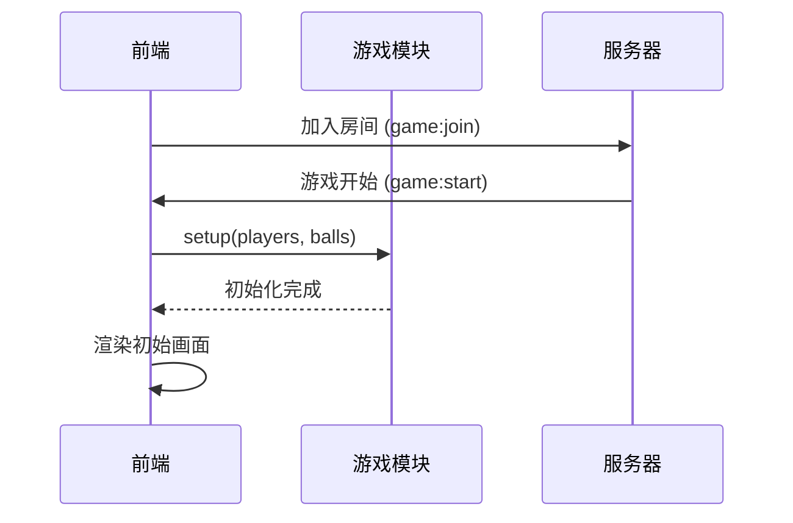
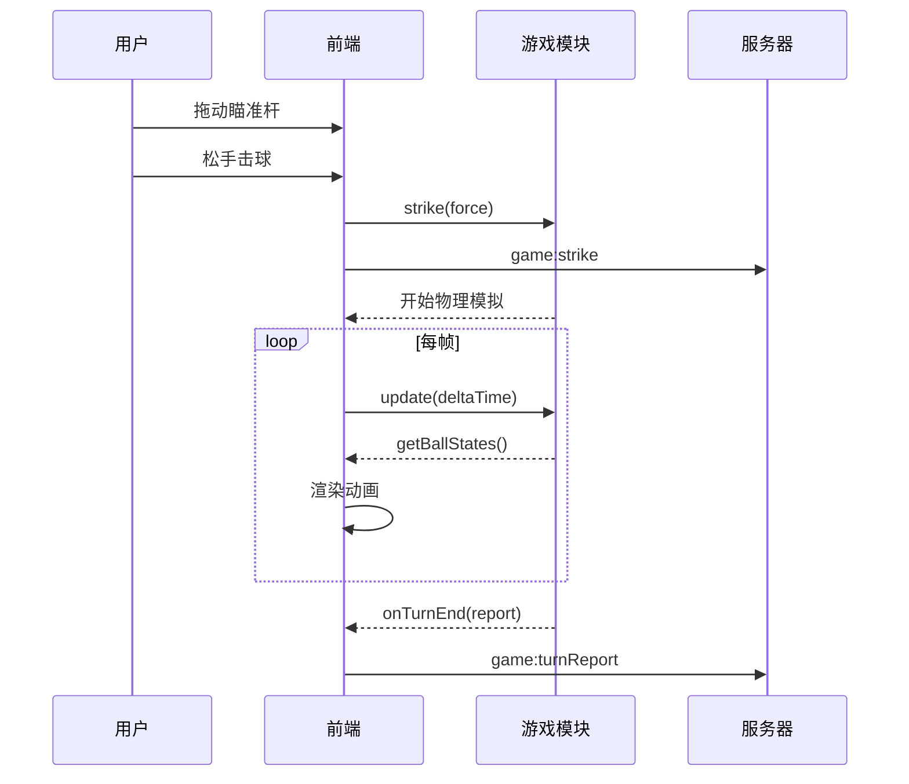
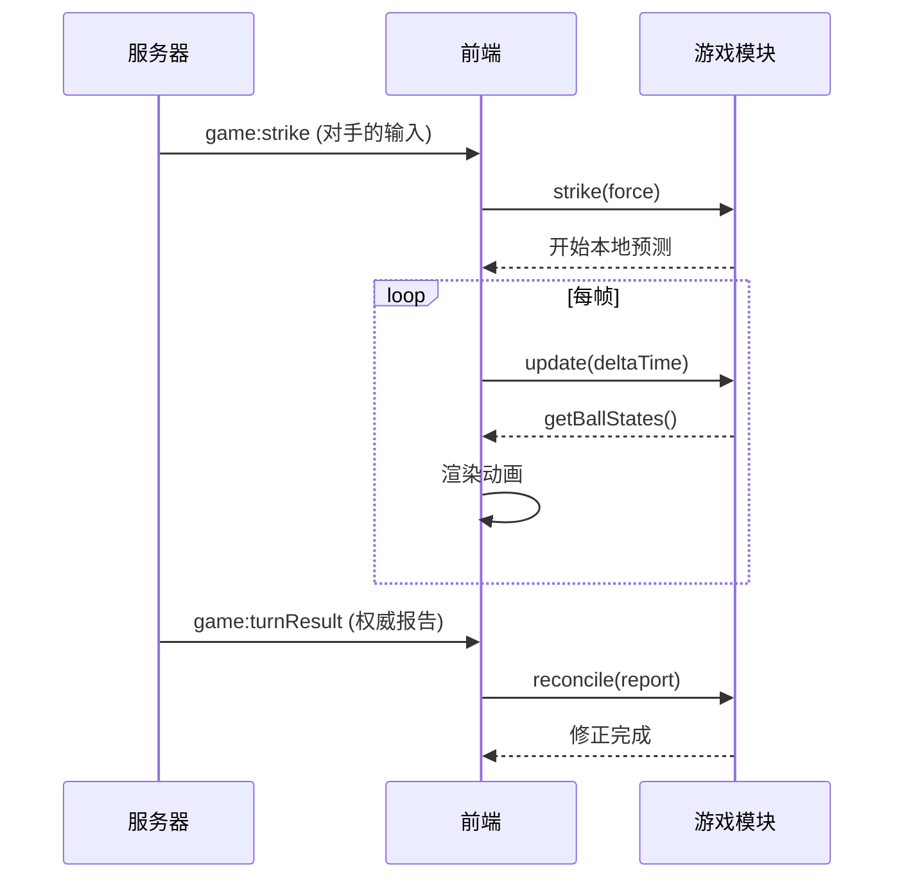

# 游戏模块前端对接API说明文档

**版本:** 1.0.0  
**最后更新:** 2025-11-1  
**目标读者:** 杨银  
**模块负责人:** 李骁

---

## 📋 目录

1. [快速开始](#1-快速开始)
2. [安装与引入](#2-安装与引入)
3. [核心API详解](#3-核心api详解)
4. [完整工作流程](#4-完整工作流程)
5. [数据结构说明](#5-数据结构说明)
6. [常见问题与调试](#6-常见问题与调试)
7. [示例代码](#7-示例代码)

---

## 1. 快速开始

### 1.1 最小可运行示例

```typescript
import Game from '../GameLogic/Game';

// 创建游戏实例
const game = new Game();

// 初始化游戏
game.setup(
  [
    { id: 'player1', name: '玩家1', ballType: null },
    { id: 'player2', name: '玩家2', ballType: null }
  ],
  [
    { id: 0, position: { x: 200, y: 200 }, isPocketed: false }, // 母球
    { id: 1, position: { x: 600, y: 200 }, isPocketed: false }, // 1号球
    // ... 添加其他球
  ]
);

// 注册回合结束回调
game.onTurnEnd((report) => {
  console.log('回合结束，权威报告:', report);
  // 这里发送给服务器
});

// 击球
game.strike({ x: 50, y: 0 });

// 游戏循环（60 FPS）
function gameLoop() {
  game.update(1/60);
  requestAnimationFrame(gameLoop);
}
gameLoop();
```

---

## 2. 安装与引入

### 2.1 文件结构

```
frontend/
├── GameLogic/              # 游戏模块（由游戏玩法程序员提供）
│   ├── Game.ts           # 主入口
│   ├── types.ts          # 类型定义
│   └── physics/          # 物理引擎（你不需要关心）
│       └── ...
└── main/             # 你的前端代码
    ├── main.ts           # 前端主入口
    ├── renderer.ts       # 渲染模块
    └── network.ts        # 网络模块
```

### 2.2 引入方式

```typescript
// TypeScript
import Game, { Vector, BallState, TurnReport } from './GameLogic/Game';

// JavaScript (如果使用 JS)
import Game from './GameLogic/Game.js';
```

---

## 3. 核心API详解

游戏模块通过 `Game` 类提供所有接口。你只需要与这一个类交互。

### 3.1 创建游戏实例

```typescript
const game = new Game();
```

**说明:** 一个游戏房间创建一个 `Game` 实例。

---

### 3.2 初始化游戏 `setup()`

#### 方法签名
```typescript
setup(players: Player[], initialBallStates: BallState[]): void
```

#### 参数说明

**players** - 玩家数组
```typescript
interface Player {
  id: string;           // 玩家唯一标识（与后端保持一致）
  name: string;         // 玩家昵称
  ballType: 'solid' | 'striped' | null;  // 球的类型（开局为 null）
}
```

**initialBallStates** - 初始球局
```typescript
interface BallState {
  id: number;           // 球的编号 (0=母球, 1-7=全色球, 8=8号球, 9-15=花色球)
  position: Vector;     // 球的位置 {x, y}
  isPocketed: boolean;  // 是否已进袋（开局都为 false）
}
```

#### 调用时机
- 收到服务器的 `game:start` 事件后立即调用

#### 示例
```typescript
// 收到服务器消息后
socket.on('game:start', (data) => {
  game.setup(data.players, data.initialBallStates);
  console.log('游戏已初始化');
});
```

---

### 3.3 击球 `strike()`

#### 方法签名
```typescript
strike(force: Vector): void
```

#### 参数说明

**force** - 施加给母球的力向量
```typescript
interface Vector {
  x: number;  // 水平方向的力（正值向右，负值向左）
  y: number;  // 垂直方向的力（正值向下，负值向上）
}
```

**力度参考值:**
- 轻击: `{ x: 20, y: 0 }`
- 中等: `{ x: 50, y: 0 }`
- 大力: `{ x: 100, y: 0 }`

#### 调用时机
- **本地玩家:** 用户完成瞄准并确认击球时
- **远程玩家:** 收到服务器的 `game:strike` 事件时

#### 示例
```typescript
// 场景1: 本地玩家击球
cueStick.onShoot((force) => {
  // 1. 调用游戏模块
  game.strike(force);
  
  // 2. 同时发送给服务器
  socket.emit('game:strike', { force });
});

// 场景2: 远程玩家击球（收到服务器转发）
socket.on('game:strike', (data) => {
  game.strike(data.force);  // 开始本地预测
});
```

---

### 3.4 每帧更新 `update()`

#### 方法签名
```typescript
update(deltaTime: number): void
```

#### 参数说明

**deltaTime** - 距离上一帧的时间间隔（单位：秒）
- 如果游戏以 60 FPS 运行，传入 `1/60` (约 0.0167)

#### 调用时机
- 在游戏循环中每帧调用一次

#### 示例
```typescript
let lastTime = 0;

function gameLoop(currentTime: number) {
  const deltaTime = (currentTime - lastTime) / 1000; // 转换为秒
  lastTime = currentTime;
  
  // 更新游戏物理
  game.update(deltaTime);
  
  // 渲染画面
  renderer.render(game.getBallStates());
  
  requestAnimationFrame(gameLoop);
}

requestAnimationFrame(gameLoop);
```

---

### 3.5 获取球的状态 `getBallStates()`

#### 方法签名
```typescript
getBallStates(): BallState[]
```

#### 返回值
返回所有球的当前状态数组。

#### 调用时机
- 在渲染函数中每帧调用，用于绘制画面

#### 示例
```typescript
function render() {
  const ballStates = game.getBallStates();
  
  ballStates.forEach(ball => {
    if (!ball.isPocketed) {
      drawBall(ball.position.x, ball.position.y, ball.id);
    }
  });
}
```

---

### 3.6 状态和解 `reconcile()`

#### 方法签名
```typescript
reconcile(report: TurnReport): void
```

#### 参数说明

**report** - 服务器广播的权威回合报告

#### 调用时机
- 收到服务器的 `game:turnResult` 事件时

#### 作用
强制修正本地的游戏状态，确保所有客户端状态一致。

#### 示例
```typescript
socket.on('game:turnResult', (report) => {
  // 用权威报告修正本地状态
  game.reconcile(report);
  
  // 更新UI（比分、下一个玩家等）
  updateScoreboard(report);
  
  if (report.turnWinnerId) {
    showWinnerDialog(report.turnWinnerId);
  }
});
```

---

### 3.7 获取当前游戏状态 `getCurrentState()`

#### 方法签名
```typescript
getCurrentState(): GameState
```

#### 返回值
```typescript
type GameState = 'waiting' | 'aiming' | 'animating' | 'ended';
```

| 状态        | 说明           | UI 应该做什么        |
| :---------- | :------------- | :------------------- |
| `waiting`   | 等待初始化     | 显示"等待中..."      |
| `aiming`    | 等待玩家瞄准   | 显示瞄准杆，允许输入 |
| `animating` | 物理模拟进行中 | 隐藏瞄准杆，播放动画 |
| `ended`     | 游戏结束       | 显示结算界面         |

#### 示例
```typescript
function updateUI() {
  const state = game.getCurrentState();
  
  if (state === 'aiming') {
    cueStick.show();
  } else {
    cueStick.hide();
  }
}
```

---

## 4. 完整工作流程

### 4.1 游戏初始化流程



**代码示例:**
```typescript
// 1. 加入房间
socket.emit('game:join', { roomId: 'room123' });

// 2. 收到游戏开始消息
socket.on('game:start', (data) => {
  // 3. 初始化游戏模块
  game.setup(data.players, data.initialBallStates);
  
  // 4. 渲染画面
  renderer.render(game.getBallStates());
});
```

---

### 4.2 本地玩家击球流程



**代码示例:**
```typescript
// 用户击球
function handleUserStrike(force: Vector) {
  // 1. 本地立即模拟
  game.strike(force);
  
  // 2. 同时通知服务器
  socket.emit('game:strike', { force });
}

// 注册回合结束回调
game.onTurnEnd((report) => {
  // 3. 模拟结束，发送权威报告
  socket.emit('game:turnReport', report);
});
```

---

### 4.3 远程玩家击球流程



**代码示例:**
```typescript
// 收到对手的击球输入
socket.on('game:strike', (data) => {
  // 立即开始本地预测
  game.strike(data.force);
});

// 收到权威报告，进行修正
socket.on('game:turnResult', (report) => {
  // 修正本地状态
  game.reconcile(report);
  
  // 更新UI
  updateTurnInfo(report);
});
```

---

## 5. 数据结构说明

### 5.1 Vector (向量)

```typescript
interface Vector {
  x: number;
  y: number;
}
```

**用途:** 表示位置、速度或力

**示例:**
```typescript
const position: Vector = { x: 100, y: 200 };
const force: Vector = { x: 50, y: -20 };
```

---

### 5.2 BallState (球的状态)

```typescript
interface BallState {
  id: number;           // 球的编号
  position: Vector;     // 位置
  isPocketed: boolean;  // 是否进袋
}
```

**球的编号规则:**
- `0`: 母球（白球）
- `1-7`: 全色球（solid）
- `8`: 8号球（黑球）
- `9-15`: 花色球（striped）

---

### 5.3 TurnReport (回合报告)

```typescript
interface TurnReport {
  finalBallStates: BallState[];   // 所有球的最终位置
  pocketedBallIds: number[];      // 本回合进袋的球
  isFoul: boolean;                // 是否犯规
  turnWinnerId: string | null;    // 是否决出胜负
  nextPlayerId: string;           // 下一个击球的玩家ID
}
```

**示例:**
```typescript
{
  finalBallStates: [
    { id: 0, position: { x: 300, y: 200 }, isPocketed: false },
    { id: 1, position: { x: 0, y: 0 }, isPocketed: true },
    // ...
  ],
  pocketedBallIds: [1, 3],  // 打进了1号和3号球
  isFoul: false,
  turnWinnerId: null,       // 游戏继续
  nextPlayerId: 'player1'   // player1 继续击球
}
```

---

### 5.4 Player (玩家)

```typescript
interface Player {
  id: string;
  name: string;
  ballType: 'solid' | 'striped' | null;
}
```

**ballType 说明:**
- 开局时为 `null`
- 第一次打进球后确定（游戏模块会自动处理）

---

## 6. 常见问题与调试

### 6.1 问题：击球后球没有移动

**可能原因:**
1. 没有调用 `update()` 方法
2. `deltaTime` 传错了（应该是秒，不是毫秒）

**解决方案:**
```typescript
// ❌ 错误
game.update(16);  // 传入了毫秒

// ✅ 正确
game.update(16 / 1000);  // 转换为秒
game.update(1 / 60);     // 或直接传固定值
```

---

### 6.2 问题：物理模拟不准确

**可能原因:**
`deltaTime` 不稳定或过大

**解决方案:**
```typescript
// 限制最大时间步长
function gameLoop(currentTime: number) {
  let deltaTime = (currentTime - lastTime) / 1000;
  lastTime = currentTime;
  
  // 防止时间步长过大（如切换标签页后）
  deltaTime = Math.min(deltaTime, 0.05);  // 最大 50ms
  
  game.update(deltaTime);
  requestAnimationFrame(gameLoop);
}
```

---

### 6.3 问题：多个客户端画面不一致

**可能原因:**
1. 没有调用 `reconcile()` 方法
2. `reconcile()` 调用时机错误

**解决方案:**
```typescript
// ✅ 确保收到 game:turnResult 后立即调用
socket.on('game:turnResult', (report) => {
  game.reconcile(report);  // 必须调用！
});
```

---

### 6.4 调试技巧

#### 可视化球的状态
```typescript
function debugRender() {
  const balls = game.getBallStates();
  
  balls.forEach(ball => {
    console.log(`Ball ${ball.id}:`, {
      x: ball.position.x.toFixed(2),
      y: ball.position.y.toFixed(2),
      pocketed: ball.isPocketed
    });
  });
}
```

#### 监控游戏状态
```typescript
setInterval(() => {
  console.log('Game State:', game.getCurrentState());
}, 1000);
```

---

## 7. 示例代码

### 7.1 完整的前端集成示例

```typescript
import Game, { Vector, BallState, TurnReport } from './gameplay/Game';
import { io, Socket } from 'socket.io-client';

class GameClient {
  private game: Game;
  private socket: Socket;
  private lastTime: number = 0;

  constructor(serverUrl: string) {
    this.game = new Game();
    this.socket = io(serverUrl);
    this.setupListeners();
  }

  // 设置所有监听器
  private setupListeners(): void {
    // ========== 游戏模块回调 ==========
    this.game.onTurnEnd((report) => {
      console.log('回合结束，发送报告给服务器');
      this.socket.emit('game:turnReport', report);
    });

    this.game.onStateUpdate((ballStates) => {
      this.render(ballStates);
    });

    this.game.onGameOver((winnerId) => {
      this.showWinner(winnerId);
    });

    // ========== 服务器消息 ==========
    this.socket.on('game:start', (data) => {
      console.log('游戏开始');
      this.game.setup(data.players, data.initialBallStates);
    });

    this.socket.on('game:strike', (data) => {
      console.log('对手击球，开始预测');
      this.game.strike(data.force);
    });

    this.socket.on('game:turnResult', (report: TurnReport) => {
      console.log('收到权威报告，进行和解');
      this.game.reconcile(report);
      this.updateUI(report);
    });
  }

  // 用户击球
  public handleUserStrike(force: Vector): void {
    const state = this.game.getCurrentState();
    if (state !== 'aiming') {
      console.warn('当前不能击球');
      return;
    }

    // 本地立即模拟
    this.game.strike(force);

    // 通知服务器
    this.socket.emit('game:strike', { force });
  }

  // 游戏循环
  public startGameLoop(): void {
    const loop = (currentTime: number) => {
      const deltaTime = Math.min((currentTime - this.lastTime) / 1000, 0.05);
      this.lastTime = currentTime;

      this.game.update(deltaTime);
      requestAnimationFrame(loop);
    };

    requestAnimationFrame(loop);
  }

  // 渲染
  private render(ballStates: BallState[]): void {
    // 清空画布
    // 绘制球台
    // 绘制所有球
    ballStates.forEach(ball => {
      if (!ball.isPocketed) {
        this.drawBall(ball);
      }
    });
  }

  private drawBall(ball: BallState): void {
    // 实现你的渲染逻辑
    console.log(`绘制球 ${ball.id} 在 (${ball.position.x}, ${ball.position.y})`);
  }

  private updateUI(report: TurnReport): void {
    // 更新比分、提示等
    console.log('下一个玩家:', report.nextPlayerId);
    if (report.isFoul) {
      console.log('犯规！');
    }
  }

  private showWinner(winnerId: string): void {
    console.log(`游戏结束！获胜者: ${winnerId}`);
    // 显示胜利弹窗
  }
}

// 使用
const client = new GameClient('http://localhost:3000');
client.startGameLoop();

// 用户点击击球按钮时
document.getElementById('strikeBtn')?.addEventListener('click', () => {
  const force = { x: 50, y: 0 };
  client.handleUserStrike(force);
});
```

---

### 7.2 简化的测试示例（单机模式）

如果你想单独测试游戏模块，不需要后端：

```typescript
import Game from './gameplay/Game';

// 创建游戏
const game = new Game();

// 初始化
game.setup(
  [
    { id: 'p1', name: 'Player 1', ballType: null },
    { id: 'p2', name: 'Player 2', ballType: null }
  ],
  [
    { id: 0, position: { x: 200, y: 200 }, isPocketed: false },
    { id: 1, position: { x: 600, y: 200 }, isPocketed: false },
    { id: 2, position: { x: 620, y: 220 }, isPocketed: false },
  ]
);

// 监听回合结束
game.onTurnEnd((report) => {
  console.log('回合报告:', report);
});

// 击球
game.strike({ x: 80, y: 0 });

// 游戏循环
setInterval(() => {
  game.update(1/60);
  
  // 打印球的位置
  const balls = game.getBallStates();
  console.log('母球位置:', balls[0].position);
}, 100);
```

---

## 8. 性能优化建议

### 8.1 渲染优化

```typescript
// ❌ 每帧都重新创建 Canvas 元素
function badRender() {
  const canvas = document.createElement('canvas');
  // ...
}

// ✅ 复用 Canvas 元素
const canvas = document.getElementById('gameCanvas') as HTMLCanvasElement;
const ctx = canvas.getContext('2d');

function goodRender() {
  ctx.clearRect(0, 0, canvas.width, canvas.height);
  // 绘制...
}
```

### 8.2 避免频繁的网络通信

```typescript
// ❌ 每帧都发送状态（过于频繁）
game.onStateUpdate((balls) => {
  socket.emit('update', balls);  // 不要这样做！
});

// ✅ 只在关键时刻通信
game.onTurnEnd((report) => {
  socket.emit('game:turnReport', report);  // 正确
});
```

---

## 9. 联系与支持

如果在对接过程中遇到问题，可以：

1. **检查控制台错误信息**
2. **使用上面的调试技巧**
3. **联系游戏玩法程序员**，提供：
   - 错误信息
   - 复现步骤
   - 当前的 `game.getCurrentState()` 返回值

---

## 10. 版本更新日志

### v1.0.0 (2025-10-18)
- ✅ 初始版本
- ✅ 实现所有 P0 和 P1 优先级 API
- ✅ 支持网络同步和状态和解

---

**祝开发顺利！** 🎱
